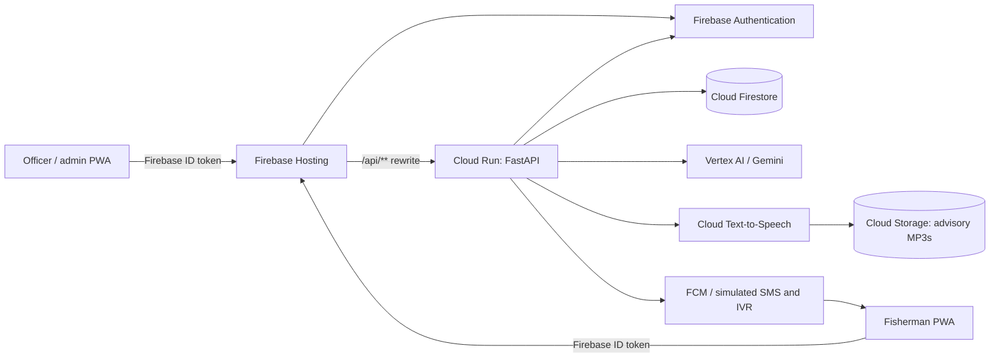
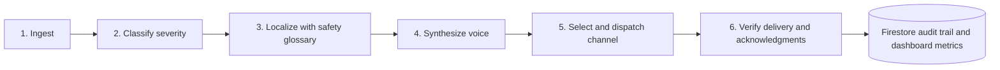
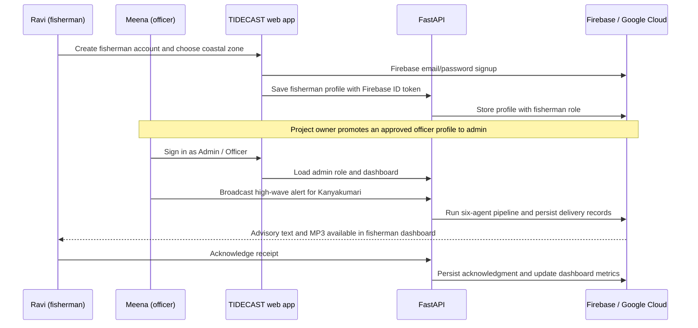

# TIDECAST

TIDECAST is a multi-agent fisheries advisory delivery system. It turns a coastal safety bulletin into a classified, glossary-safe, multilingual, voice-ready advisory and selects a delivery channel based on each fisherman's recent connectivity. The dashboard surfaces delivery reach and zones that have not acknowledged an advisory.

> This is a hackathon demonstration. The advisory feed, SMS, and IVR gateways are simulated; Firebase Cloud Messaging, Firestore, Cloud Storage, Gemini, and Cloud Text-to-Speech are integrated through their production SDKs. Do not treat the application as an official or operational maritime-warning service.

## Problem and outcome

Coastal bulletins are only useful when they reach people in time, in a language they understand, and through a channel that works for their connectivity. TIDECAST turns one authoritative bulletin into a targeted, multilingual, voice-ready advisory and records whether fishermen acknowledge it.

## System architecture



## Six-agent advisory pipeline



## Technology stack

| Layer | Technology | Responsibility |
| --- | --- | --- |
| Web application | React, Vite, React Router | Responsive officer and fisherman flows |
| Authentication | Firebase Authentication | Email/password identity and ID tokens |
| API | FastAPI, Uvicorn | Role checks, profiles, advisories, acknowledgments |
| Data | Cloud Firestore | Users, zones, advisories, deliveries, verification data |
| AI | Vertex AI Gemini | Severity classification and localization |
| Voice | Cloud Text-to-Speech | English, Tamil, and Telugu MP3 advisories |
| Media | Cloud Storage for Firebase | Public read-only generated advisory audio |
| Hosting and runtime | Firebase Hosting, Cloud Run | Same-origin web delivery and API execution |
| Quality | Pytest, Vitest, GitHub Actions | Backend tests, UI mounting test, production build |

## User flow



### Demo script for judges

1. Open the landing page and select **Get Started**.
2. Create Ravi as a **Fisherman**, select **Kanyakumari**, and sign in. Ravi is taken to `/app`.
3. Create Meena as a fisherman, then in Firestore change only `users/{Meena UID}.role` to `admin`.
4. Sign out, choose **Admin / Officer**, and sign in as Meena. She is taken to `/admin`.
5. Open **Compose Advisory**, choose **High wave alert**, target Kanyakumari, and broadcast: “High waves of 3 metres are expected. Do not venture into the sea.”
6. Return to Ravi’s dashboard, open the new advisory, play the generated MP3, and acknowledge it. Refresh Meena’s dashboard to show the persisted metric.

## Project layout

```text
backend/                 FastAPI API and six-stage advisory pipeline
  agents/                Ingest, classify, localize, synthesize, deliver, verify
  api/                   Advisory, user, delivery, and admin routes
  core/                  Firebase initialization, auth, and application settings
  data/                  Mock advisories, safety glossary, and zone GeoJSON
  tests/                 Pytest API and agent unit tests
frontend/                React + Vite fisherman and administrator web app
infra/                   Firebase Hosting configuration and Firestore rules/indexes
.github/workflows/ci.yml GitHub Actions validation workflow
```

## Prerequisites

- Python 3.13+
- Node.js 22+ and npm
- A Firebase project with Authentication, Firestore, Cloud Storage, and Cloud Messaging enabled
- A Google Cloud project with Vertex AI and Cloud Text-to-Speech enabled
- Google Cloud Application Default Credentials for the backend (`gcloud auth application-default login`) or an equivalent workload identity in deployed environments

## Configuration

Create local environment files that are never committed. Backend variables can be placed in `backend/.env`; frontend variables belong in `frontend/.env.local`.

### Backend (`backend/.env`)

| Variable | Required | Default | Purpose |
| --- | --- | --- | --- |
| `GCP_PROJECT_ID` | Yes for a real deployment | `tidecast-507006` | Google Cloud/Firebase project ID |
| `GCP_REGION` | No | `asia-south1` | Vertex AI region |
| `FIREBASE_STORAGE_BUCKET` | Yes for a real deployment | `tidecast-507006.firebasestorage.app` | Bucket used for generated audio |
| `GEMINI_MODEL` | No | `gemini-2.0-flash` | Vertex AI model for classification and localization |
| `PORT` | No | `8000` | FastAPI listen port |

The backend uses Application Default Credentials, not a checked-in service-account key. For local development, authenticate the Google Cloud CLI before starting the API. The pytest suite replaces cloud integrations with test doubles and does not require credentials.

For a new Firebase project, provision its default `PROJECT_ID.firebasestorage.app` bucket in **Firebase Console → Storage** (or the Firebase Storage API) before running the voice pipeline. New default buckets require the Blaze plan; this project keeps only generated advisory MP3s in that bucket.

### Frontend (`frontend/.env.local`)

| Variable | Required | Purpose |
| --- | --- | --- |
| `VITE_FIREBASE_API_KEY` | Yes | Firebase Web API key |
| `VITE_FIREBASE_AUTH_DOMAIN` | Yes | Firebase authentication domain |
| `VITE_FIREBASE_PROJECT_ID` | Yes | Firebase project ID |
| `VITE_FIREBASE_STORAGE_BUCKET` | Yes | Firebase Storage bucket |
| `VITE_FIREBASE_MESSAGING_SENDER_ID` | Yes | Firebase Cloud Messaging sender ID |
| `VITE_FIREBASE_APP_ID` | Yes | Firebase web app ID |
| `VITE_API_BASE_URL` | Yes | API origin, such as `http://localhost:8000` |

Use Firebase Console **Project settings → Your apps → Web app** to obtain the frontend configuration. Deploy `infra/firestore.rules` and `infra/firestore.indexes.json` with the Firebase CLI once the project is configured.

### Test accounts and roles

Enable **Email/Password** under Firebase Console **Authentication → Sign-in method**. Self-service registration always creates a `fisherman` user; this is intentional so a public user cannot grant themselves administrator access. To provision an officer for a local or demo environment:

1. Create the account through the normal fisherman sign-up flow.
2. In Firestore, open `users/{uid}` for that account and change `role` from `fisherman` to `admin`.
3. Sign out and sign back in after selecting **Admin / Officer** on the TIDECAST login page.

An account’s Firestore role is authoritative. Selecting a role in the browser is an intent check and cannot elevate access.

## Run locally

Install and start the backend in one terminal:

```powershell
cd backend
python -m venv .venv
.\.venv\Scripts\Activate.ps1
python -m pip install -r requirements.txt
uvicorn main:app --reload --host 0.0.0.0 --port 8000
```

The API health endpoint is available at `http://localhost:8000/api/health`; interactive API documentation is at `http://localhost:8000/docs`.

Install and start the frontend in another terminal:

```powershell
cd frontend
npm ci
npm run dev
```

Vite serves the frontend at `http://localhost:5173`. Set `VITE_API_BASE_URL=http://localhost:8000` before starting it so authenticated application pages can reach the API.

## Test and build

```powershell
cd backend
python -m pytest -q

cd ..\frontend
npm run test
npm run build
```

The backend tests validate the health and active-advisory API behavior plus deterministic ingestion and channel-selection/delivery logic. The frontend test confirms that the React application mounts and renders the landing route.

## Continuous integration

GitHub Actions runs on every push and pull request. It installs backend dependencies and runs pytest, then installs frontend dependencies, runs Vitest, and produces a Vite build. See [the CI workflow](.github/workflows/ci.yml).

## Production deployment

Production serves the React build from Firebase Hosting and rewrites `/api/**` to the `tidecast-backend` Cloud Run service in `asia-south1`. The frontend uses relative API paths in production, avoiding any hard-coded localhost address.

Before first deployment, provision the Firebase Storage default bucket and ensure the Cloud Run runtime service account can access Firestore, Vertex AI, Text-to-Speech, and the advisory-audio bucket. Then run:

```powershell
gcloud run deploy tidecast-backend --source backend --project tidecast-507006 --region asia-south1 --allow-unauthenticated

cd infra
firebase deploy --project tidecast-507006 --only firestore:rules,firestore:indexes,hosting
```

After deployment, verify the Hosting home page, `https://tidecast-507006.web.app/api/health`, both role logins, one advisory broadcast, generated audio, and an acknowledgment before presenting the application.

## Git and GitHub

This repository is initialized locally with an initial commit. A remote is intentionally not configured until the repository URL is supplied. To publish it after creating an empty GitHub repository:

```powershell
git remote add origin <repository-url>
git branch -M main
git push -u origin main
```
