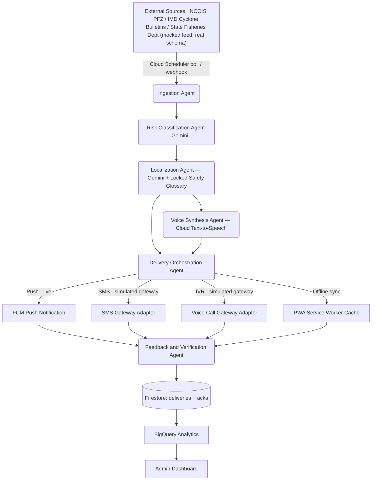

# Tidecast — Product Requirements Document

**A single line, cast across the tide. This is the bridge between a cyclone warning and a fisherman who hasn't heard it yet.**

**Hackathon:** 6R Hackathon 2026
**Problem Statement Selected:** Fisheries Advisory Delivery App
**Author:** Max (Bingi Dinesh Kumar)
**Doc status:** Build-ready. Rename the product if you want — the architecture doesn't change.

> **Project name: TIDECAST.** Finalized. An earlier working name, "MatsyaSetu," appeared in initial naming exploration and has been fully replaced — no remaining references to it should exist anywhere in this document or in the codebase. Use TIDECAST in the repo name, README, package.json, environment variables, and pitch deck.

---

## 0. Mentor's Note — Why This Problem Statement, Read This First

I looked at all three problem statements the way a judge scoring 20 teams would: what can you *fake* in a demo, and what can you *not* fake. That's the real filter.

| Criteria | Fisheries Advisory App | Library Recommender | Lecture Resource Recommender |
|---|---|---|---|
| Real-world stakes | Life-safety (drowning, missing-at-sea) | Convenience | Teacher time-saving |
| Can be faked with a weekend Colab notebook? | No — needs multilingual pipeline, offline design, multi-channel delivery | Yes — cosine similarity + a CSV | Partially — embedding search over papers |
| Differentiation across 20 teams | High — most teams will build a shallow "SMS blaster," few will build the multi-agent verification loop | Very low — everyone converges on the same recsys architecture | Medium — most will do RAG-over-arXiv and stop there |
| Matches your track record | Directly — same shape as IntelliASHA (rural India, verification agent, won 1st nationally) | No prior pattern | No prior pattern |
| Judge emotional impact | High — you can open with Cyclone Ockhi | Low | Low |
| Technical depth ceiling | High — offline-first PWA, translation-with-safety-glossary, multi-channel failover, agent-based orchestration | Low — ceiling is a slightly-better recommender | Medium |

**Verdict: Fisheries Advisory App.** It's the only one of the three where "doing it properly" is actually hard, which means your execution quality becomes the differentiator instead of the idea itself. With 20 teams on the same three prompts, that's the only lever you have.

I am not going to pretend every part of this is trivial to build in your time window — see Section 16 (Known Risks) for exactly where the honest limits are, and how to handle them in front of judges without lying.

---

## 1. Problem Statement

Fishermen in India's coastal and rural regions frequently lack timely, understandable access to fishing-zone advisories — cyclone warnings, potential fishing zone (PFZ) data, high-wave alerts — because of three compounding failures:

1. **Language barrier** — official advisories are issued in English/Hindi/formal regional language, not the spoken dialect of the fisherman receiving it.
2. **Connectivity gap** — coastal and deep-sea zones have patchy or no mobile data; advisories that assume a working internet connection simply don't arrive.
3. **Literacy and format mismatch** — a text bulletin is useless to someone who can't read it fluently, or who is on a boat with both hands full.

The cost of this failure is not hypothetical. In Cyclone Ockhi (2017), a cyclone-specific advisory for Tamil Nadu and Kerala was not issued until the day of landfall. By then, most boats had already gone out to sea. Official toll: 204 dead or missing fishermen in Tamil Nadu alone, with a Rajya Sabha report later confirming the advisory came too late and didn't convey the severity clearly enough to be acted on. This is a solved-in-theory, broken-in-practice problem: the *data* (INCOIS, IMD) exists. The *last mile* — getting it to a fisherman, in his language, in a form he can act on, on a connection that might not exist — does not.

---

## 2. Solution Approach

Build **Tidecast**: a multi-agent advisory delivery system that takes a raw government/meteorological advisory and gets it to a fisherman in under a minute, in his own language and dialect, over whatever channel is actually available to him right now — SMS, voice call (IVR), push notification, or offline-cached app — with a closed feedback loop that confirms whether it was actually received and acted on.

The core insight that makes this different from "a translation app" or "an SMS blaster": **delivery is not a single channel decision, it's a continuously re-evaluated one.** A fisherman near the coast with 4G gets a rich push notification with audio. The same fisherman 40km offshore with zero bars gets an SMS the moment his phone catches a tower, and a cached, audio-narrated version pre-loaded on his app from the last sync. The system doesn't assume connectivity — it assumes the *absence* of it, and designs delivery around that.

---

## 3. War Factors — What Makes This Top 1%, Not Just Top 20

Anyone can build "translate advisory, send SMS." Here's what separates a demo from something a judge remembers:

1. **Safety-critical translation with a locked glossary, not free-form Gemini output.** Life-safety terms (cyclone, return to shore, storm surge, do not venture) are pre-verified per language by a fixed glossary; only the surrounding narrative text is LLM-generated. This is a genuine responsible-AI story — most teams will let an LLM freely translate a safety warning and never think about mistranslation risk. You explicitly design against it.
2. **Voice-first, not text-first.** A large fraction of your actual users may not read fluently in any script. Every advisory has a synthesized audio version by default, not as an accessibility afterthought.
3. **Multi-agent verification loop**, structurally identical to what already won you IntelliASHA — a Feedback & Verification Agent that confirms delivery and closes the loop, flags zones that went dark (no acknowledgment), and escalates. This is a "system that knows what it doesn't know" — a strong technical narrative for judges.
4. **Offline-first architecture as a first-class design constraint**, not a stretch goal. Service-worker cached last-known-good advisory, IndexedDB storage, background sync on reconnect.
5. **Channel arbitration engine** — the Delivery Orchestration Agent picks SMS vs IVR vs push vs offline-cache per user based on last-known connectivity signal, not a static preference.
6. **Government/NGO-facing dashboard** with real-time reach and acknowledgment analytics — this turns your submission from "an app" into "civic infrastructure," which is a materially stronger positioning in front of judges than a consumer app pitch.

---

## 4. Target Users & Personas

**Primary: Ravi, 34, deep-sea fisherman, Kanyakumari coast.**
Owns a basic Android phone, spotty connectivity beyond ~15km from shore, reads Tamil haltingly, doesn't read English/Hindi bulletins at all. Needs: a single glance or a single listen to know "is it safe to go out today, and if not, why."

**Secondary: Meena, 41, fisheries department field officer.**
Needs a dashboard to know which zones have acknowledged today's advisory and which haven't, so she can dispatch a physical warning boat/loudspeaker van to the zones that went dark.

**Tertiary: State Fisheries Department / NGO stakeholder.**
Needs aggregate reach and compliance reporting for policy and funding justification.

---

## 5. Key Features

**Must-have (MVP for demo):**
- Advisory ingestion from a realistic mock feed structured like actual INCOIS/IMD bulletins
- Gemini-based severity classification (Critical / High / Medium / Informational)
- Locked-glossary translation into at least 3 Indian coastal languages (e.g., Tamil, Telugu, Odia) + English
- Text-to-speech audio generation per advisory per language
- Fisherman PWA: offline-capable advisory feed, audio playback, one-tap acknowledgment, large icon-first UI
- Simulated multi-channel delivery (push via FCM live; SMS/IVR shown as a clearly-labeled simulated gateway log, see Section 16)
- Admin dashboard: live zone map, active advisories, reach/ack percentage
- Manual advisory composer/override for the admin (in case a human needs to broadcast something the automated feed missed)

**Should-have:**
- Delivery Orchestration Agent with real channel-arbitration logic based on last-seen connectivity
- Feedback & Verification Agent that flags "dark zones" (no acknowledgment within X minutes) for the dashboard
- Historical analytics (BigQuery) — reach trend, ack trend, language distribution

**Stretch (mention in pitch as roadmap, don't over-promise in demo):**
- Real INCOIS/IMD API integration (pending public API access)
- Real telecom SMS gateway (pending DLT registration — this is a real regulatory step, not a code problem)
- Community relay: a designated "zone captain" device that can offline-relay an advisory to nearby boats via local mesh/Bluetooth when no one has signal at all

---

## 6. System Architecture



**Orchestration:** Google ADK (Agent Development Kit) coordinates all six agents as a pipeline with clear input/output contracts between stages, deployed via Vertex AI Agent Engine / Reasoning Engine. Each agent stage is independently testable — you can unit test "does the Localization Agent correctly preserve the locked glossary term for 'cyclone'" without running the full pipeline.

**Event flow:** Cloud Pub/Sub decouples ingestion from processing, so a burst of advisories (e.g., multiple zone updates during an active cyclone) doesn't block the pipeline. Cloud Tasks handles retry logic for delivery attempts that fail (e.g., SMS gateway timeout).

---

## 7. Multi-Agent Design (Google ADK)

| Agent | Input | Output | Notes |
|---|---|---|---|
| **Ingestion Agent** | Raw advisory feed (mocked JSON matching INCOIS/IMD bulletin structure) | Normalized advisory object | Runs on Cloud Scheduler poll (e.g., every 15 min) or webhook trigger |
| **Risk Classification Agent** | Normalized advisory | Severity tag + affected zone IDs | Gemini classifies severity; zone matching via geofence polygon lookup in Firestore |
| **Localization Agent** | Advisory + severity + target languages | Per-language text (SMS-safe ≤160 char + full narrative) | Safety-critical terms pulled from a locked glossary table, not freely generated; only connective narrative is Gemini-generated |
| **Voice Synthesis Agent** | Per-language text | Audio file URL per language | Cloud Text-to-Speech; cached in Cloud Storage, reused for identical advisory+language pairs |
| **Delivery Orchestration Agent** | Advisory + target users + last-known connectivity signal per user | Delivery attempts per channel | Decision logic: recent app ping within N min → push; else → SMS; if repeated SMS failure → IVR; always also written to offline cache queue |
| **Feedback & Verification Agent** | Delivery attempts + ack events | Delivery status + "dark zone" flags | Mirrors the verification-loop pattern from IntelliASHA — this is your strongest, most defensible technical claim in the pitch |

---

## 8. Data Model (Firestore)

```
users
  - uid, phone, name, preferred_language, home_port, boat_id
  - zone_id (foreign key to zones)
  - last_seen_online (timestamp, used by Delivery Orchestration Agent)
  - role: "fisherman" | "admin"

zones
  - zone_id, name, state, coastal_district
  - polygon (geojson)

advisories
  - advisory_id, source, raw_text, severity
  - zone_ids: []
  - created_at, expires_at
  - translations: { "ta": "...", "te": "...", "or": "...", "en": "..." }
  - audio_urls: { "ta": "gs://...", "te": "gs://...", ... }

deliveries
  - delivery_id, advisory_id, user_id
  - channel: "push" | "sms" | "ivr" | "offline_cache"
  - status: "sent" | "delivered" | "failed" | "acknowledged"
  - sent_at, ack_at
```

**BigQuery** mirrors `deliveries` + `advisories` for aggregate analytics (reach %, ack rate by zone/language/severity, time-to-acknowledge distribution) — this is what powers the admin dashboard's historical charts without hammering Firestore for analytical queries.

---

## 9. API Surface (FastAPI, Python)

```
POST   /advisories/ingest              # triggered by Cloud Scheduler or manual webhook
GET    /advisories/active?zone_id=     # fisherman app: current advisories for a zone
POST   /advisories/compose             # admin manual override/broadcast
GET    /users/me
POST   /users/register                 # phone OTP + language + zone selection
POST   /deliveries/ack                 # fisherman taps "received / safe"
GET    /admin/dashboard/stats          # aggregate reach/ack metrics
GET    /admin/zones/status             # per-zone dark-zone flag status
```

---

## 10. Tech Stack Mapping (Google Cloud, as specified)

| Layer | Technology |
|---|---|
| Frontend (fisherman PWA + admin dashboard) | React (Vite), IBM Carbon-inspired design system, service worker + IndexedDB for offline |
| Backend API | Python, FastAPI, deployed on Cloud Run |
| Agent orchestration | Google ADK, deployed via Vertex AI Agent Engine / Reasoning Engine |
| LLM | Gemini (via Vertex AI) — classification, localization narrative generation |
| Voice | Cloud Text-to-Speech |
| Database (operational) | Firestore |
| Database (analytics) | BigQuery |
| Messaging/events | Cloud Pub/Sub, Cloud Tasks, Cloud Scheduler |
| Auth | Firebase Auth (phone OTP for fishermen, email for admin) |
| Push notifications | Firebase Cloud Messaging (FCM) |
| File/audio storage | Cloud Storage |
| Hosting | Firebase Hosting (frontend) + Cloud Run (backend) |
| CI/CD | GitHub Actions |
| Observability | Cloud Logging, Cloud Monitoring |

---

## 11. Step-by-Step Build Plan (sequenced, not timeboxed)

**Phase 0 — Foundation**
Repo scaffold (monorepo: `/frontend`, `/backend`, `/agents`, `/infra`), GCP + Firebase project setup, ADK environment bootstrap, GitHub Actions skeleton (lint + typecheck stub jobs so CI is green from commit 1).

**Phase 1 — Data layer**
Firestore schema + security rules, seed a real coastal-zone geojson (a handful of actual Tamil Nadu/Kerala/Odisha coastal districts, not made-up shapes — this small detail reads as "real research" to a judge), mock advisory feed generator that mimics actual INCOIS/IMD bulletin structure.

**Phase 2 — Agent core**
Build each of the six agents in ADK in isolation with mocked Gemini responses first, so agent contracts are provable before burning API quota. Then wire real Gemini calls. Unit test the Localization Agent's glossary-lock behavior specifically — this is your responsible-AI talking point, make sure it actually works, not just claimed.

**Phase 3 — Backend API**
FastAPI service wrapping the agent pipeline, Pub/Sub trigger wiring, deploy to Cloud Run.

**Phase 4 — Fisherman PWA**
Offline-first React app: advisory feed, audio player, language selector, one-tap ack, visible offline indicator, service worker caching last-known-good advisory.

**Phase 5 — Admin dashboard**
Live zone map (reach/ack overlay), advisory composer, delivery log table, analytics charts from BigQuery.

**Phase 6 — Channel integration**
FCM push (live, real). SMS/IVR gateway adapters built to a clean interface (`NotificationGateway.send()`) with a simulated/mock provider behind it for demo — see Section 16 for exactly how to frame this to judges.

**Phase 7 — CI/CD & quality bar**
GitHub Actions: lint, typecheck, unit tests, build, Lighthouse CI, axe-core accessibility scan, deploy on merge to main.

**Phase 8 — Polish and pitch**
Record the demo path end-to-end (ingest → classify → translate → voice → deliver → ack → dashboard update), write the pitch narrative anchored on Cyclone Ockhi, rehearse the honest framing of what's live vs. simulated.

---

## 12. Non-Functional Requirements

- **Accessibility:** icon-first UI, audio-first advisory consumption, large tap targets, WCAG AA color contrast, screen-reader labels on all interactive elements, `prefers-reduced-motion` respected throughout.
- **Offline resilience:** app must show the last-known-good advisory and remain fully navigable with zero network.
- **Security:** Firestore security rules scoped by role and zone, Firebase Auth-gated API routes, rate limiting on public ingestion endpoints.
- **Scalability:** Cloud Run auto-scaling, Pub/Sub decoupling so a burst of advisories during an active cyclone doesn't create a processing bottleneck.
- **Observability:** structured logs per agent stage so a failure can be traced to exactly which stage of the pipeline broke.

---

## 13. CI/CD & Quality Bar

- GitHub Actions pipeline: `lint → typecheck → unit test → build → accessibility audit (axe-core) → Lighthouse CI → deploy`
- ESLint + Prettier (frontend), Ruff + mypy (backend Python)
- Conventional commits, PR template, branch protection on `main`
- README with: problem, architecture diagram, setup instructions, environment variables table, and a clearly labeled "what's live vs. simulated in this demo" section (see Section 16 — judges respect this more than they respect a claim that turns out to be false under questioning)

---

## 14. Success Metrics (for the product, and for judging alignment)

| Metric | Target framing |
|---|---|
| Time from advisory ingestion to first delivery attempt | Under 60 seconds |
| Acknowledgment rate per zone | Dashboard-visible, drives "dark zone" escalation |
| Language coverage | 4 languages at MVP, architecture supports N without code change |
| Offline reliability | App fully functional with zero network for previously-synced advisories |
| Judging rubric alignment | Innovation (multi-agent + glossary-locked translation), Impact (life-safety, real case anchor), Technical execution (working pipeline, CI/CD, tests), Design (Carbon-style system, offline-first, accessible), Presentation (honest, well-rehearsed demo) |

---

## 15. Known Risks & Honest Caveats — Read This Before You Pitch

Being straight with you here because getting caught overclaiming in Q&A is worse than not having the feature at all:

1. **INCOIS/IMD do not have an easy public real-time API.** Build a mock feed with a *realistic* schema (matches actual bulletin structure/fields) and say so plainly in your pitch: "this ingests from a structured feed matching INCOIS bulletin format; production integration is a partnership/API-access conversation, not a technical blocker." That's a stronger, more credible line than pretending it's live.
2. **SMS/IVR at telecom scale in India requires DLT (Distributed Ledger Technology) registration with a telecom aggregator.** You cannot legally send bulk SMS through a real Indian telecom route in a 4-hour build. Build the `NotificationGateway` interface for real, and demo it against a sandbox/mock provider, clearly labeled in the UI and in your pitch as "gateway abstraction ready for a registered aggregator (e.g., Gupshup, Karix) in production." Never present a mocked SMS as if it went to a real number in front of judges — if asked directly, say exactly what I just told you.
3. **Gemini-translated regional dialects are not verified by native speakers.** This is exactly why the locked-glossary design for safety-critical terms exists — lean into this as a deliberate responsible-AI decision, not a limitation you're hiding.
4. **Offline PWA support on very old/basic Android devices** (which some target users may actually have) can be inconsistent. Feature-detect and degrade gracefully to plain SMS-only mode rather than assuming every user has a modern browser.

---

## 16. Appendix — Case Anchor & Sources

- Cyclone Ockhi (2017): official Tamil Nadu toll of 204 dead/missing fishermen; Rajya Sabha report (Feb 2019) found the cyclone-specific advisory was issued the day of landfall, after most boats had already gone to sea. Use this as your opening pitch line — it is real, verifiable, and it is precisely the failure mode this product targets.
- IMD's four-stage cyclone warning protocol (Alert → Warning → Post-Landfall Outlook) is the real-world structure your severity classification should mirror, not invent from scratch.
- Cite your sources on the pitch deck's "why this matters" slide — a judge who fact-checks a claim and finds it solid is a judge who trusts everything else you say for the rest of Q&A.
